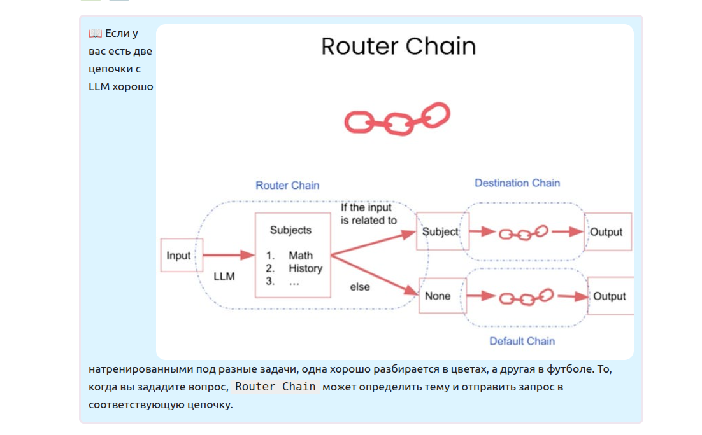

Как вы могли догадаться из названия, **цепочки (Chains)** - это один из фундаментальных строительных блоков фрэймворка `LangChain`. Они представляют собой просто цепочку компонентов, которые будут выполнены в определённом порядке. 

*Официальным определением цепочек является следующее:*

Цепочка состоит из звеньев, которые могут быть как примитивами, так и другими цепочками. Примитивами могут быть либо промпты, LLM, utils, либо другие цепочки. Таким образом, цепочка — это, по сути, конвейер, который обрабатывает входные данные, используя определенную комбинацию примитивов. Интуитивно это можно рассматривать как «шаг», который выполняет определенный набор операций над входными данными и возвращает результат. Это может быть что угодно: от прохождения через LLM на основе промпта до применения Python-функции к тексту.

Цепочки делятся на несколько основных типов: 
* `Generic chains` - общего назначения
* `Utility chains` - выполняющие конкретную функцию (например, вычислять математические выражения)
* `Combine Documents chains` - цепочки для работы с документами  
и другие.

📖 `Runnable` - наиболее близкий по смыслу перевод "запускаемый объект".

`Runnable` в `LangChain` — это базовый интерфейс, который лежит в основе работы с компонентами **LangChain**, такими как языковые модели, парсеры вывода, промпты и др. Он обеспечивает единообразный и предсказуемый способ взаимодействия с этими компонентами.

Основные характеристики `Runnable`:

* Позволяет вызывать компонент с одним входом и получать выход (`invoke`).
* Поддерживает пакетную обработку нескольких входов параллельно (`batch` и `batch_as_completed`), что улучшает производительность при обработке множества независимых запросов.
* Поддерживает потоковую выдачу результатов по мере их генерации (`stream`).
* Позволяет композировать несколько `Runnable`-компонентов вместе с помощью `LangChain Expression Language (LCEL)` для создания сложных конвейеров обработки - **цепочек**.

Простыми словами это любой объект из `LangChain`, который можно запустить/вызвать методом `invoke`.
В прошлых уроках мы уже создавали `Runnables`, вызывая llm и шаблон промпта, просто ещё не знали об этом.

`LCEL` `(LangChain Expression Language)` — это декларативный язык выражений в `LangChain`, предназначенный для построения и оркестровки цепочек (chains) из существующих компонентов `Runnable`. Вместо того чтобы описывать, как именно выполнять шаги, вы описываете, что должно произойти, а `LangChain` оптимизирует выполнение на этапе запуска.

Что он позволяет делать?:
* декларативный способ составлять цепочки
* стандартизирует интерфейсы
* проще персонализировать различные части цепочки
* позволяет легко заменять компоненты
* поддержка потоковой, пакетной и асинхронной обработки «из коробки»

    
Звенья цепи записываются последовательно через символ **`|`**. Сама цепочка тоже становится `Runnable`.

## 📖 Стандартный интерфейс всех `Runnables` имеет 3 метода:

 
 * `invoke` - обрабатывает одиночный запрос к модели
 * `batch` - обрабатывает список запросов к модели
 * `stream` - позволяет получать ответ модели в формате стриминга (можно увидеть,как модель генерирует ответ токен за токеном). Возвращает ответ модели в виде итерируемого объекта

Так же есть асинхронные реализации методов: `ainvoke`, `abatch`, `astream`. Для многопоточной работы.

**Добавим ещё звено:** Чтобы получать ответ от модели в виде строки, готовой для дальнейшего использования просто импортируем ещё один `Runnable` из `LangChain` - `StrOutputParser` и добавляем его в конец цепочки.

В качестве звеньев цепи могут выступать не только `Runnables`, но, например, и Python функции. 
Давайте представим, что мы получаем откуда-то сырой необработанный текст, который содержит пустые строки и много ненужных пробелов. Как вы помните, нам приходится считать количество израсходованных токенов, и не хочется их дополнительно тратить на ненужные лишние символы. К тому же такой текст выглядит неопрятно

Cоздадим цепочку, которая будет очищать поданный в неё текст от ненужных символов. Цепочки такого типа называют `Transform Chain`.

### Вложенные цепочки

Рассмотрим пример с вложенными цепочками, когда необходимо одну цепочку использовать внутри другой.

