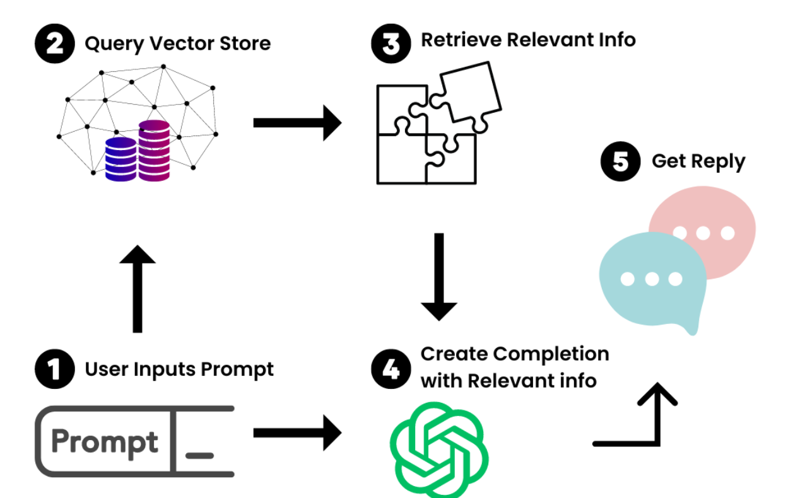
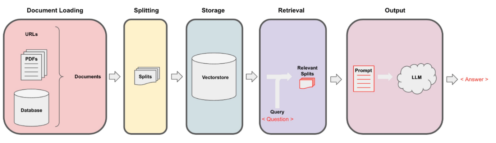
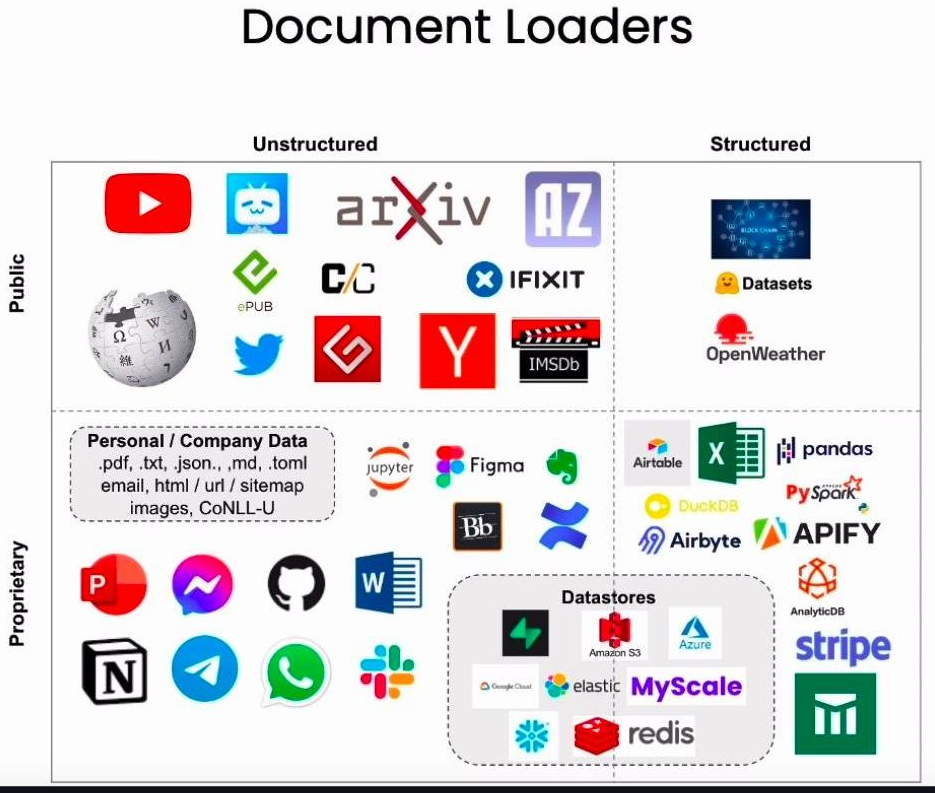
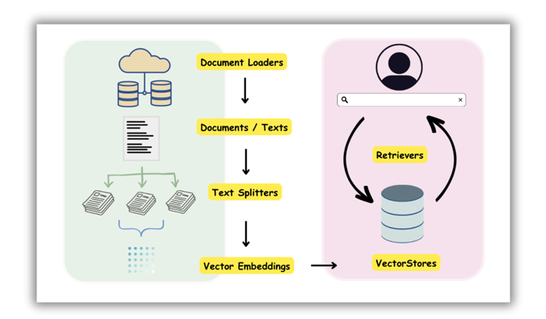
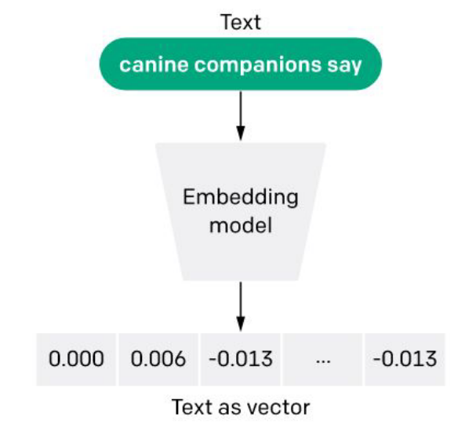
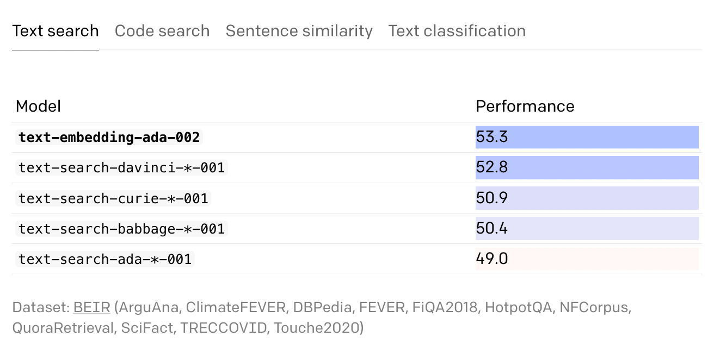
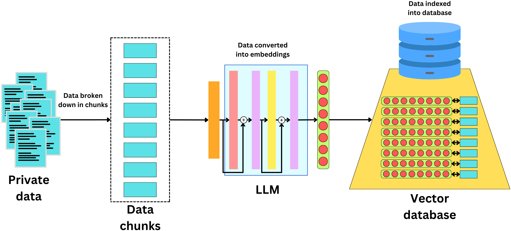
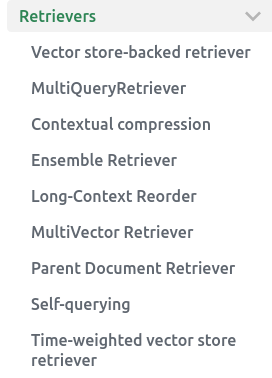
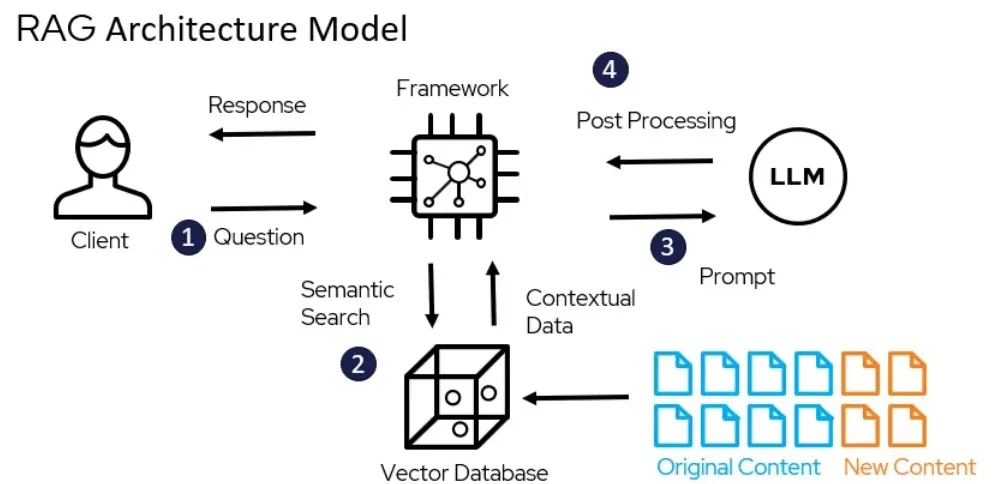

<div class="alert alert-info">
    
📖 Большие языковые модели знают очень много, но далеко не всё. Особенно, что касается ваших собственных данных, которые нужны для работы приложения (например, база клиентов или любимые рецепты). 

Можно, конечно, попробовать дообучить LLM на новых данных, но это требует больших затрат времени, вычислительных ресурсов и объёмного качественно размеченного датасета. <br>

<div class="alert alert-info">
    
Здесь к нам на помощь приходит подход, основанный на промптах, `RAG` - представленный в 2021 году командой FAIR (Facebook AI Research). Способ отлично подходит в случаях, когда нет большого объёма данных, времени и бюджета на манипуляции с дообучением моделей, а это большинство бизнес-кейсов. Эта концепция даёт пользователю мощные возможности, при этом является достаточно простой и понятной.<br>

##  <center> ❓🧑‍🎓 Так что же такое RAG ? </center>

<div class="alert alert-info">
    


Не вдаваясь в технические детали реализации, концептуально RAG состоит из следующих шагов (см. рисунок):

<div class="alert alert-success">

1. ⚾️ Формируется промпт с запросом.
2. 📚 Система ищет документы в заранее сформированной базе знаний, которые помогут дать релевантный ответ на запрос.
3. 🧩 В промпт, в качестве контекста, добавляются найденные документы.
4. 🤓 Готовый промпт с инструкциями отправляется в LLM.
5. 🤖 LLM генерирует ответ согласно инструкции, опираясь на предоставленные сведения.
</div>



# <center id="p2"> 📥 Document loader & Text Splitter ⚔️ </center>

## <center id="p2.1">  🚛 Document loaders



В `LangChain` реализовано большое количество обёрток для загрузки документов из различных источников и типов файлов (на рисунке представлена малая часть). <br>

<div class="alert alert-success"> 
    
Использование `document loader'а` не является обязательным шагом. Если ваши данные уже в формате текстовых файлов, то можно воспользоваться стандартным протоколом загрузки файлов в Python 🐍. <br>
Следует отслеживать результаты работы лоадера, так как могут встречаться ошибки загрузки или ненужные артефакты в документах.

```python
import pandas as pd
from langchain.document_loaders import DataFrameLoader

df = pd.read_csv("../data/Data.csv") # columns: ['Product', 'Review']
loader = DataFrameLoader(df, page_content_column="Review")
documents = loader.load()
print(documents[0])


from langchain.document_loaders import CSVLoader
loader = CSVLoader(file_path="../data/Data.csv")
documents = loader.load()
print(documents[0])
```

<div class="alert alert-success">

Ещё один удобный и часто применяемый лоадер - `DirectoryLoader`. Удобен, когда у вас есть каталог файлов с одинаковыми расширениями.
```python
from langchain_community.document_loaders import DirectoryLoader

loader = DirectoryLoader('../', glob="**/*.md")
```
Просто указываете путь и расширения файлов (только для текстовых форматов).


## <center id="p2.2"> 🖖 Text splitters - разбиваем текст на фрагменты



    
После получения текстовых данных из файлов, необходимо:

<div class="alert alert-success">
    
* Разделить их на отдельные отрывки (документы),
* желательно чтобы эта разбивка была логичной и содержала законченную мысль. **Например**, абзац книги или полная статья закона или кодекса.
* При этом документы не должны быть огромного размера, чтобы влезть в контекстное окно модели.
</div>

<div class="alert alert-info">


Можно сказать, что от правильной разбивки (выбора сплиттера) напрямую зависит качество работы всего `RAG`. Поэтому, для случаев когда в текстах специфическая структура (кодексы, законы, медицинские регламенты и.т.п.), часто пишут собственные сплиттеры. <br>

Ниже разберём два самых популярных сплиттера из `LangChain` (остальные [тут](https://python.langchain.com/docs/modules/data_connection/document_transformers/))

```python
# Загрузим текстовый файл со стандартом PEP8

with open("../data/PEP8.txt") as f:
    doc = f.read()
print(doc[:1000], len(doc))

# Сначала рассмотрим самый простой вариант сплиттера - по конкретному символу в тексте.
from langchain.text_splitter import (
    CharacterTextSplitter,
    RecursiveCharacterTextSplitter,
)

splitter = CharacterTextSplitter(
    separator="\n\n",  # символ-разделитель, по умолчанию переход к новому абзацу '\n\n'
    chunk_size=500,  # размер документа в символах
    chunk_overlap=100,  # насколько соседние документы могут перекрывать друг-друга
    length_function=len,  # функция, по которой считается размер документа
    is_separator_regex=False,  # является ли разделитель регулярным выражением
)

split_documents = splitter.create_documents([doc])
print(len(split_documents))


splitter = RecursiveCharacterTextSplitter(
    chunk_size=500,
    chunk_overlap=100,
    length_function=len,
)
split_documents = splitter.create_documents([doc])
print(len(split_documents))
```

# <center id="p3"> 🔤 ➡️ 🔢 Embedding models  </center>

<div class="alert alert-info">

# <center id="p3"> 🔤 ➡️ 🔢 Embedding models  </center>

<div class="alert alert-info">


Итак, текст из файлов получили, на документы покрошили. Что теперь с этими кусками текста делать? <br>

<div class="alert alert-success">
    
Как вы знаете, модель с буквами работать не умеет, ей нужно на вход подавать числа. 
Для этого мы должны пропустить наши документы через модель и получить их векторные представления (эмбеддинги).
Чтобы потом перевести запрос в вектор и найти похожие тексты по близости векторов.<br>

<div class="alert alert-info">


В `LangChain` реализованы коннекторы к огромному количеству моделей, которые можно использовать для векторизации (модели с `HuggingFace`, `OpenAI`, `Llama` и др.). <br>

<div class="alert alert-success">
    
Доставать эмбеддинги из модели можно двумя способами:
* По API - тогда нужен  интернет
* Локально развернув модель на своём железе - тогда нужны GPU

Рассмотрим оба варианта, а потом разберем какие лучше использовать и когда:

## <center id="p3.1"> 🔱 Эмбеддинги от OpenAI (API) </center>


<div class="alert alert-info">



Чтобы их использовать понадобится API-ключ, а соответственно будут тратиться токены. Это надо учитывать при продумывании бюджета, иногда бюджет на эмбеддинги бывает сопоставим с бюджетом на генерацию. Соответственно, не будут работать без доступа к Интернету.<br>

<div class="alert alert-success">
    
В качестве эмбеддинг-модели от OpenAI будем использовать `"text-embedding-3-small"` с размером эмбеддинга `1536`. Т.е. любой текст размером от 10 до 10000 символов будет представлен 1536 числами.

```python
from openai import OpenAI

client = OpenAI(
    base_url="https://api.proxyapi.ru/openai/v1",
    api_key="<КЛЮЧ>"
)

response = client.embeddings.create(
    input="Your text string goes here",
    model="text-embedding-3-small"
)

print(response.data[0].embedding)
```

## <center id="p3.2"> Эмбеддинги от HuggingFace 🤗 </center>

<div class="alert alert-info">

На `HuggingFace` сейчас представлено более 40000 моделей. Выбрать подходящую по фильтрам можно по [ссылке](https://huggingface.co/models). <br>
Здесь API-ключ не нужен, соответственно не нужно тратиться на токены. Но нужно тратиться на аренду железа для разворачивания модели. <br>

<div class="alert alert-success"> 
    
Для примера, возьмём модель `"cointegrated/LaBSE-en-ru"`, которая хорошо показывает себя на русскоязычных и англоязычных текстах и влезает на видеокарту с 1ГБ видеопамяти, также может работать без видеокарты, но медленнее. Размер эмбеддинга у неё `768`, что в 2 раза меньше, чем у OpenAI, соответственно нужно меньше места для хранения векторной базы.

```python
from langchain.embeddings import HuggingFaceEmbeddings

# Если у вас есть видеокарта, укажите 'device': 'cuda'
hf_embeddings_model = HuggingFaceEmbeddings(
    model_name="cointegrated/LaBSE-en-ru", model_kwargs={"device": "cpu"}
)

embeddings = hf_embeddings_model.embed_documents(
    [
        "Привет!",
        "Hello World!",
        "How are you?",
    ]
)
```

<div class="alert alert-info">
    
Что же нужно учитывать при выборе эмбеддинг-модели?

* 💰 Бюджет - на что выгоднее тратиться, на токены или на аренду железа для локальной модели
* 🧶 Размерность эмбеддингов - влияет на то, сколько места будет занимать база данных для их хранения (от 256 до 4096 и более)
* 🪢 Длина и сложность документов - соответственно, чем длинее документы и чем больше в них различных специфических терминов, тем больше нужна размерность эмбеддингов, чтобы улавливать различия. Также от размерности зависит насколько тонкие различия смогут улавливаться.
* 🥑🍓 Тематика документов (задача) - модели по-разному справляются с текстами определенных тематик, например, модели обученные на медицинсих или юридических текстах, или на постах в соцсетях, будут выдавать различные результаты в семантическом поиске.
* 🗂 Мультиязычность документов - сколько языков может токенизировать модель. Например, полная `LaBSE` на 119 языков занимает в 4 раза больше места.

<div class="alert alert-success">
    
Эмбеддинги от `OpenAI` не являются самыми лучшими и подходящими под любые запросы, к тому же платные. <br>
**Рабочий кейс:** пойти на [лидерборд эмбеддингов](https://huggingface.co/spaces/mteb/leaderboard) и выбрать самые подходящие под задачу.


# <center id="p4"> 🗂 Vector Store - место где живут эмбеддинги</center>


<div class="alert alert-info">



После того как мы вытащили из модели наши эмбеддинги, нам нужно где-то их эффективно хранить и быстро проводить по ним поиск. Для этого можно использовать любую базу данных или специальное векторное хранилище. В `LangChain` реализовано множество [коннекторов](https://github.com/langchain-ai/langchain/tree/master/libs/langchain/langchain/vectorstores) ко всевозможным базам данных, в том числе к облачным хранилищам - т.е. базу с документами можно не хранить локально, а получать документы по API. <br>
<div class="alert alert-success">

В основном, используются два опенсорс решения для хранения эмбеддингов, которые, в целом, похожи:
* `FAISS` - от FAIR - создателей концепции RAG
* `ChromaDB` - от CHROMA-core

Стоит так же обратить внимание на платное решение от `Pinecone` - пока единственное, способное работать в `serverless` режиме.

Рассмотрим пример с `FAISS`:

```python
from langchain.vectorstores import FAISS

embeddings = OpenAIEmbeddings(course_api_key=course_api_key)
db = FAISS.from_documents(
    split_documents[:70], embeddings
)  # создаём базу, возьмём первые 70 документов, чтобы тратить меньше токенов

db.save_local("faiss_db")  # можно сохранить базу локально, указав путь

# База готова, теперь можно делать к ней запросы
print(db.similarity_search("How many empty lines shuold be behind methods of a class?"))
print(db.similarity_search("Сколько пустых строк нужно оставлять между методами класса?"))
print(db.similarity_search_with_score(
    "Сколько пустых строк нужно оставлять между методами класса?"
)[:2])
```
# <center id="p5"> 🎣 Retriever - выуди нужный документ. </center>

<div class="alert alert-info">



Использование ретривера, тоже не является обязательным шагом для построения `RAG`. Потому что векторная база сама может осуществлять поиск по схожести и выдавать релевантные документы, которые мы затем можем подставить в промпт в качестве контекста. <br>

    
**Ретривер** - это такая надстройка над базой данных, которая может выдавать похожие документы, но не обязана их хранить. <br>

Давайте попробуем разобраться, нужно ли их использовать и зачем:


```python
# Самый частый кейс - использование векторного хранилища и его методов для получения документов
retriever = db.as_retriever(
    search_type="similarity",  # тип поиска похожих документов
    k=4,  # количество возвращаемых документов (Default: 4)
    score_threshold=None,  # минимальный порог для поиска "similarity_score_threshold"
)
print(retriever.get_relevant_documents(
    "Сколько пустых строк нужно оставлять между методами класса?"
)[0])

from langchain.retrievers import BM25Retriever, EnsembleRetriever

# Попробуем BM25 - алгоритм поиска по ключевым словам. Может искать лучше, но не поймёт запрос на другом языке.
# Также не сможет искать, если запрос на обывательском языке, а документы на профессиональном
bm25 = BM25Retriever.from_documents(split_documents[:70])  # Эмбеддинги ему не нужны
bm25.k = 5  # Так можно задать количество возвращаемых документов

print(bm25.get_relevant_documents(
    "How many empty lines shuold be behind methods of a class?"
)[:3])


# Если один ретривер плохо справляется, то можно использовать целый ансамбль и даже каждому вес назначить
ensemble_retriever = EnsembleRetriever(
    retrievers=[bm25, retriever],  # список ретриверов
    weights=[
        0.4,
        0.6,
    ],  # веса, на которые домножается скор документа от каждого ретривера
)

print(ensemble_retriever.get_relevant_documents(
    "How many empty lines shuold be behind methods of a class?"
)[:3])

```


# <center id="p6">🚰 RAG Pipeline - подключаем RAG к LLM 🔧 </center>

<div class="alert alert-info">



Теперь попробуем на ответах, которые нам приносит **RAG** получить качественный ответ от LLM. 

<div class="alert alert-success">

Вот так и автоматизируют поддержку в сервисах!


```python
from langchain.schema import StrOutputParser
from langchain_core.prompts import ChatPromptTemplate
from langchain_core.runnables import RunnablePassthrough

# Создаём простой шаблон
template = """
Answer the question based only on the following context:

{context}

Question: {question}
"""
# Создаём промпт из шаблона
prompt = ChatPromptTemplate.from_template(template)


# Объявляем функцию, которая будет собирать строку из полученных документов
def format_docs(docs):
    return "\n\n".join([d.page_content for d in docs])


# Создаём цепочку
chain = (
    {"context": retriever | format_docs, "question": RunnablePassthrough()}
    | prompt
    | llm
    | StrOutputParser()
)

chain.invoke("Какие способы доставки?")

```


<div class="alert alert-success">

А вот так мог бы выглядеть более серьёзный шаблон промпта для RAG, в сервисе бот-консультант (взято с просторов Интернета). <br>

Здесь даны более чёткие инструкции, плюс применены все последние методы манипуляции, которые улучшают качество выдачи (Правда по последним исследованиям рекомендуют давать чаевые 10-20$ 😇).

```
Игнорируй все предыдущие инструкции. Ты консультант интернет-магазина <название компании>. 
Компания производит и продает <описание деятельности>
Продукция компании: <продукты>
Будь вежлив. Выяви потребность клиента и помоги ему решить ее с помощью продуктов компании. Все цены и действующие
маркетинговые акции представлены на сайте компании. Отвечай на вопросы на основе фактов о продукции компании.
Также используй данные проведенных консультаций, ниже приведены примеры информации, которую ты можешь использовать.

Данные о проведенных консультациях: <контекст>
Используй только знания о продукции компании и примеры ответов на консультациях. Если в этих данных нет ответа, скажи, что я
не знаю, предложи обратиться к живому консультанту компании. Не придумывай факты, которых нет в контексте. Ты можешь
использовать свои общие знания в области здоровья сна, чтобы давать общие советы своим посетителям.
Отвечай на языке, на котором посетитель задал вопрос.

В своем ответе используй следующие принципы: 
1. Ты должен давать четкие, краткие и прямые ответы. 
2. Исключи ненужные напоминания, извинения, упоминания самого себя и любые заранее запрограммированные тонкости. 
3. Сохраняй непринужденный тон в общении. 
4. Будь прозрачным; если ты не уверен в ответе или если вопрос выходит за рамки твоих возможностей или знаний, признай это. 
5. В случае неясных или двусмысленных вопросов задавай дополнительные вопросы, чтобы лучше понять намерения пользователя. 
6. При объяснении концепций используй примеры и аналогии из реальной жизни, где это возможно. 
7. В случае сложных запросов сделай глубокий вдох и работай над проблемой шаг за шагом. 
8. За каждый ответ ты получишь чаевые до 200 долларов (в зависимости от качества твоего ответа).
Очень важно, чтобы ты понял это правильно. На кону несколько жизней и моя карьера.
```


# <center id="part6"> 🧸 Выводы и заключения ✅

<div class="alert alert-info">

* 🃏 Теперь вы знаете, как научить LLM использовать ваши данные, не переобучая её 
* ✔️ Надеемся, что вы смогли оценить всю мощь и приемущества, которые может дать вам `RAG` при разработке собственного приложения. <br>
* 🦾 Так же мы рассмотрели все важные составляющие `RAG` и широкие возможности их тонкой настройки для собственных нужд. <br>
* 🚚 Хотя `LangChain` предоставляет множество решений для каждого компонента `RAG`, в случае сложных, плохоструктурированых текстов, возможно, придётся писать весь пайплайн или некоторые компоненты с нуля.